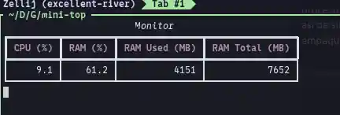
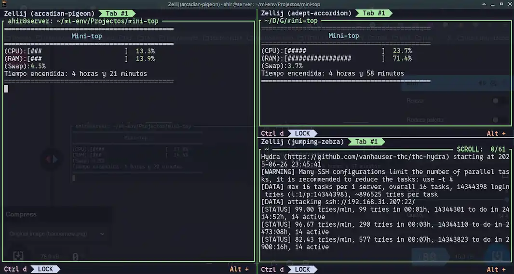

# mini-top

[![python-badge-lg]][python-web]

[python-badge-lg]: https://img.shields.io/badge/Python-3776AB?logo=python&logoColor=fff&style=for-the-badge
[python-web]: https://www.python.org/

Monitor de recursos del sistema para Linux, minimalista y por consola.



lptop and server running


---

## Qué hace?

- Muestra en tiempo real:
  - Uso de CPU
  - Uso de RAM

 para servidores,laptops o terminales ligeras.

---

##  instalacion rapida rápida (Ubuntu / Debian)


repositorio apt:

```bash
echo "deb [trusted=yes] https://jahirwh.github.io/mini-top/apt/ ./" | sudo tee /etc/apt/sources.list.d/mini-top.list
sudo apt update
sudo apt install mini-top

```
## Para ejecutar el programa en el terminal escribe:

- mini-top

## Ojo 
 - Despues de instalar el programa borra el apt list asi 
 ```bash

 sudo rm /etc/apt/sources.list.d/mini-top.list
```
