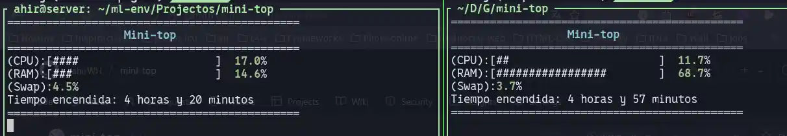

# Mini-top

[python-badge-lg]: https://img.shields.io/badge/Python-3776AB?logo=python&logoColor=fff&style=for-the-badge
[python-web]: https://www.python.org/
[![python-badge-lg]][python-web]

Monitor de recursos del sistema para Linux, minimalista  por consola.



laptop and server running


---

## Que hace?
- Teda info del uso de la  CPU y RAM en tiempo real


## Testing
- Debian 12
- Ubuntu 22

## Uso
```bash
python app.py
```